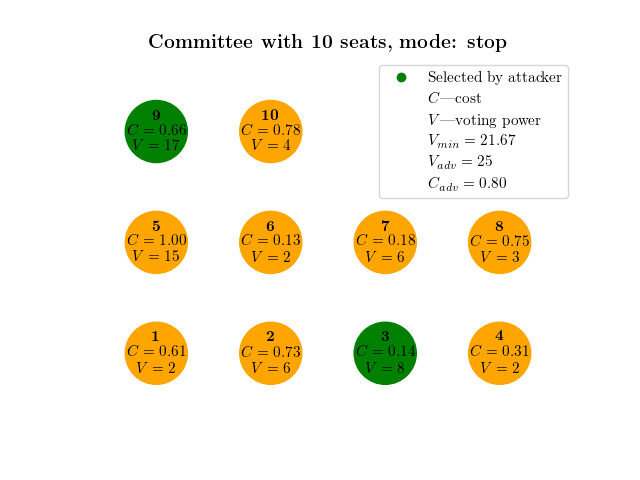
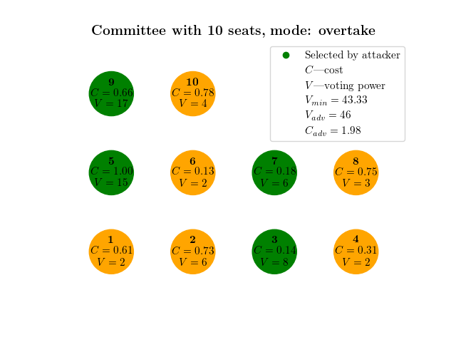

# Knapsack problem and committee selection

## Problem formulation

There is a committee with  seats. 
An attacker wants to select certain seats at a minimum cost in order to stop/overtake the committee.

Let  denote the cost of selecting seat , 
and  denote the weight (voting power) of seat . 
Define  to be a binary variable (i.e.  
representing whether seat  is going to be selected or not. That is, 
 are our decision variables: if , seat 
 shall not be selected, and if , seat 
 shall be selected.

The total voting power of the committee with  seats is:
<p align="center">

</p>

The obtained voting power by the attacker is defined as follows:
<p align="center">

</p>
and the cost of this is
<p align="center">

</p>

We are interested in two scenarios:
1. In order to **stop** the committee, the attacker needs to obtain 1/3 or more of the total 
voting power.
2. In order to **overtake** the committee, the attacker needs to obtain more than 2/3 of the total 
voting power.

Define . We now formulate the following optimization problem:
<p align="center">

</p>

<p align="center">

</p>

<p align="center">

</p>

where  if  and 
 is a sufficient small positive number if 
.

In the relevant literature, this problem is known as a **minimization knapsack problem**.

## Implementation

The coding language of this project is ````Python 3.9````. [Pyomo](http://www.pyomo.org/) 
and [GLPK](https://www.gnu.org/software/glpk/) are used to solve the optimzation problem.

## Getting Started
Please follow these instructions to install all the requirements and use the package correctly.

### Requirements and Installation
**Make sure you have installed:**
1. [Python 3.9](https://www.python.org/downloads/release/python-390/)
2. [GLPK](https://www.gnu.org/software/glpk/)

**Download the code:**
```bash
git clone https://github.com/roman1e2f5p8s/kp_committee
```

**Create a virtual environment ```venv```:**
```bash
python3.9 -m venv venv
```

**Activate the virtual environment:**
- On Unix or MacOS:
```bash
source venv/bin/activate
```
- On Windows:
```bash
venv\Scripts\activate.bat
```

**Install the dependencies:**
```bash
pip3.9 install -r requirements.txt
```

### Usage

A simple example can be generated using the following command with required arguments:

```bash
python3.9 main.py --n_nodes=N_NODES --n_seats=N_SEATS --mode=MODE
```

See help files for more details:

```bash
python3.9 main.py --help
```

```
usage: main.py --n_nodes {4,5,...} --n_seats {4,5,...} --mode {stop,overtake} [-h]
               [--seed {1,2,...}] [--data {zipf,random}] [--zipfc > 0]
               [--max_weight {1,2,...,20}] [--solver SOLVER] [--latex] [--hide_plots]
               [--novis] [--verbose]

Multiple seats in the committee: solve minimization knapsack problem

required arguments:
  --n_nodes {4,5,...}        number of nodes in the network
  --n_seats {4,5,...}        number of seats in the committee
  --mode {stop,overtake}     mode to simulate: either stop or overtake the committee

optional arguments:
  -h, --help                 show this help message and exit
  --seed {1,2,...}           seed for random generator, defaults to 2021
  --data {zipf,random}       if zipf, generate costs and weights according to Zipf law; 
                             if random, generate random data for costs and weights, defaults to zipf
  --zipfc > 0                zipf coefficient (if data needs to be generated using Zipf law), 
                             defaults to 1
  --max_weight {1,2,...,20}  maximum value of voting power (if random data needs to be generated), 
                             defaults to 20
  --solver SOLVER            solver name, defaults to glpk
  --latex                    use LaTeX in plots, defaults to False
  --hide_plots               do not show plots, defaults to False
  --novis                    do not visualize the results, defaults to False
  --verbose                  verbose outputs, defaults to False
```

### Examples

The example below was generated using the following command:

```bash
python3.9 main.py --n_nodes=10 --n_seats=10 --mode=stop --data=random --latex
```

<div>

</div>
<b>Figure 1: Seats selection to stop the committee: an attacker would need to select seats 3 and 9
in order to stop the committee (with obtained voting power of 25) at the minimum possible cost of 0.8.
</b>

To simulate committee overtaking, we simply change the ````mode````:

```bash
python3.9 main.py --n_nodes=10 --n_seats=10 --mode=overtake --data=random --latex
```

<div>

</div>
<b>Figure 2: Seats selection to overtake the committee: an attacker would need to select seats 3, 5, 7 
and 9 in order to overtake the committee (with obtained voting power of 46) at the minimum possible 
cost of 1.98.
</b>
